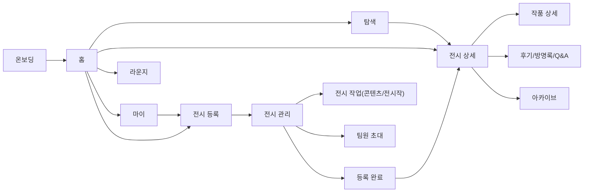

# Display U

**대학 전시를 알리는 순간부터 감상이 이어지는 순간까지**

작가와 관람자를 잇는 대학생 전시 플랫폼

## 팀원 및 프론트엔드 역할 분담

<!-- TODO: 실제 팀원 정보로 채워주세요 (GitHub 링크, 담당 화면/기능 등) -->

|                   프로필                    | 이름  | GitHub | 담당 (화면 / 기능) |
| :-----------------------------------------: | :---: | :----: | :----------------- |
|  |       | [@아이디](https://github.com/) |                    |
|  |       | [@아이디](https://github.com/) |                    |
|  |       | [@아이디](https://github.com/) |                    |

## 기술 스택

<div align="center">

|      Type       |                                                                                                              Tool                                                                                                               |
| :-------------: | :---------------------------------------------------------------------------------------------------------------------------------------------------------------------------------------------------------------------------: |
|     Bundler     |                                                                                                                                  |
|     Library     |                                                                                                                    |
|    Language     |                                                                                                                |
|   Formatting    |                 |
|    Git Hooks    |                                                                                                                           |
| Package Manager |                                                                                                                                    |
| Version Control |                  |

</div>

## 폴더 구조

```
src/
├── api/                    # Axios 클라이언트, 엔드포인트, 에러 핸들링
│   ├── dto/                #   요청/응답 DTO 타입
│   └── endpoints/          #   도메인별 API 함수
├── assets/                 # 이미지, 아이콘 등 정적 리소스
├── bootstrap/              # 앱 초기화 (MSW 등)
├── components/             # UI 컴포넌트
│   ├── ui/                 #   디자인 시스템 공통 컴포넌트 (도메인 무관)
│   └── <feature>/          #   도메인별 컴포넌트 (예: exhibition, artwork)
├── constants/              # 상수 정의
├── hooks/                  # 커스텀 훅 (queries/ : 서버 상태 훅)
├── mocks/                  # MSW 핸들러
├── pages/                  # 페이지 컴포넌트
├── providers/              # Context Provider
├── router/                 # 라우트 설정
├── stores/                 # 전역 상태 (Zustand)
├── styles/                 # 글로벌 스타일, 디자인 토큰
│   ├── tokens/             #   디자인 토큰
│   │   ├── primitive.css   #     원시 팔레트 (색상, 폰트 크기 등 원시 값)
│   │   ├── semantic.css    #     의미 토큰 (용도 기반)
│   │   └── theme.css       #     라이트/다크 테마 매핑
│   ├── typography.css      #   타이포그래피 유틸 클래스
│   └── index.css           #   스타일 진입점
├── types/                  # 공통 타입 정의
└── utils/                  # 유틸리티 함수
```

## 컨벤션

> 전체 규칙은 [`CONVENTION.md`](./CONVENTION.md)를 따릅니다.

## 실행 방법

> Node 18 이상, pnpm 10 이상이 필요합니다.

```bash
# 의존성 설치
pnpm install

# 개발 서버 실행
pnpm dev
```

## 화면 목록 및 플로우

전체 화면 설계와 플로우는 아래 Figma 와이어프레임에서 확인할 수 있습니다.

🔗 **[Figma 와이어프레임 바로가기](https://www.figma.com/design/LaGNAlmezyyWFs6uC0MBQN/%EC%B5%9C%EC%A2%85-%EC%99%80%EC%9D%B4%EC%96%B4%ED%94%84%EB%A0%88%EC%9E%84--6-26-%EC%98%88%EC%A0%95-?node-id=5-3890)**

<!-- TODO: 아래 표를 실제 화면 목록으로 채워주세요 -->

### 플로우

| 구분 | 단계 |
|---|---|
| 온보딩 | 온보딩 → 비회원 둘러보기 또는 로그인 → (신규가입 시 닉네임 설정 → 가입완료) → 홈 |
| 관람 | 홈/탐색 → 전시 상세 → 작품 상세 / 콘텐츠 갤러리 / 후기·방명록·Q&A → 저장·기록(아카이브) |
| 전시 등록(대표자) | 전시 등록하기 → 작가 인증 → 전시 작가명 설정 → 기본정보 입력 → 전시 관리(대시보드) → 전시 작업(콘텐츠 등록 + 전시작 등록) / 팀원 초대 / 공개 시점 설정 → 등록 완료 |
| 팀원 초대 | 전시 관리에서 초대 → 팀원이 초대 수락 → 작가명 설정 → 참여 완료 |
| 전시작 등록 | 전시 작업 → 내 작품 등록 또는 대신 등록 → 기본정보·이미지 입력 → 등록 완료 |

---

### 화면 흐름도 (Mermaid)

> GitHub README.md는 ```mermaid``` 코드 블록을 별도 설정 없이 자동으로 렌더링합니다.


