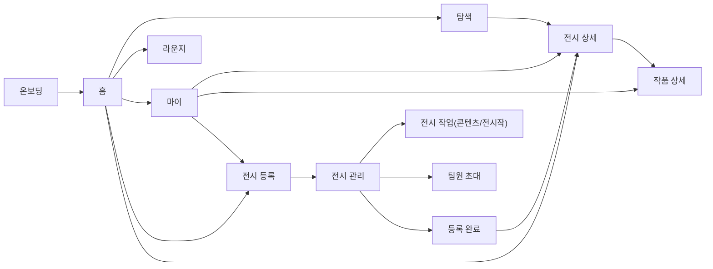

# Display U

**대학 전시를 알리는 순간부터 감상이 이어지는 순간까지**

작가와 관람자를 잇는 대학생 전시 플랫폼

## 팀원 및 프론트엔드 역할 분담

<!-- TODO: 실제 팀원 정보로 채워주세요 (GitHub 링크, 담당 화면/기능 등) -->

<div align="center">

|                   이름                   |                           담당 (화면 / 기능)                            |
| :--------------------------------------: | :---------------------------------------------------------------------: |
| [서현민](https://github.com/hyunmin1756) |                온보딩 페이지, 탐색 페이지, 라운지 페이지                |
|   [안재인](https://github.com/anjaein)   |                   MSW, API 연동, 인증/권한 흐름 로직                    |
|  [이승철](https://github.com/chulee-53)  | 홈페이지, 전시 상세/작품 상세 페이지, CSS(디자인 시스템, 반응형 디자인) |
|   [정아람](https://github.com/aram426)   |               마이페이지, 전시 등록/관리 플로우, 지도 API               |

</div>

## 기술 스택

<div align="center">

|      Type       |                                                                                                       Tool                                                                                                        |
| :-------------: | :---------------------------------------------------------------------------------------------------------------------------------------------------------------------------------------------------------------: |
|     Bundler     |                                                                                                                    |
|     Library     |                                                                                                      |
|    Language     |                                                                                                  |
|     Routing     |                                                                                             |
|  Server State   |                                                                                          |
|   HTTP Client   |                                                                                                                 |
|     Styling     |                                                                                             |
|     Mocking     |                                                                                                         |
|   Formatting    |   |
|    Git Hooks    |                                                                                                                   |
| Package Manager |                                                                                                                    |
| Version Control |    |

</div>

## 폴더 구조

> 프로젝트에서 지향한 도메인 중심 폴더 구조입니다. 일부 디렉터리는 기능 확장에 따라 추가될 예정입니다.

```
src/
├── api/                    # Axios 클라이언트, 엔드포인트, API 타입 관리
│   ├── dto/                # 요청/응답 DTO 타입
│   └── endpoints/          # 도메인별 API 함수
├── assets/                 # 이미지, 아이콘 등 정적 리소스
├── components/             # UI 컴포넌트
│   ├── ui/                 # 공통 UI 컴포넌트
│   └── <feature>/          # 도메인별 컴포넌트
├── constants/              # 공통 상수
├── hooks/                  # 커스텀 훅
│   └── queries/            # TanStack Query 기반 서버 상태 훅
├── mocks/                  # MSW Mock 데이터 및 핸들러
├── pages/                  # 라우트 단위 페이지 컴포넌트
├── styles/                 # 글로벌 스타일 및 디자인 토큰
│   └── tokens/             # primitive, semantic 디자인 토큰
├── stores/                 # 전역 상태 관리 (필요 시 Zustand 도입 예정)
├── types/                  # 공통 타입
├── utils/                  # 유틸리티 함수
└── Router.tsx              # 라우터 설정
```

## 컨벤션

> 전체 규칙은 [`CONVENTION.md`](./CONVENTION.md)를 따릅니다.

## 실행 방법

> Node 18 이상, pnpm 10 이상이 필요합니다.

```bash
# 의존성 설치
pnpm install

# 개발 서버 실행
pnpm dev
```

## 화면 목록 및 플로우

전체 화면 설계와 플로우는 아래 Figma 와이어프레임에서 확인할 수 있습니다.

🔗 **[Figma 와이어프레임 바로가기](https://www.figma.com/design/LaGNAlmezyyWFs6uC0MBQN/%EC%B5%9C%EC%A2%85-%EC%99%80%EC%9D%B4%EC%96%B4%ED%94%84%EB%A0%88%EC%9E%84--6-26-%EC%98%88%EC%A0%95-?node-id=5-3890)**

<!-- TODO: 아래 표를 실제 화면 목록으로 채워주세요 -->

### 플로우

| 구분        | 단계                                                                                           |
| ----------- | ---------------------------------------------------------------------------------------------- |
| 온보딩      | 온보딩 → 비회원 둘러보기 또는 로그인 → (신규가입 시 닉네임 설정 → 가입완료) → 홈               |
| 관람        | 홈/탐색 → 전시 상세 → 작품 상세 / 콘텐츠 갤러리 / 후기·방명록·Q&A (라운지)                     |
| 전시 등록   | 전시 등록하기 → 작가 인증 → 기본정보 입력 → 전시 작가명 설정 → 전시 관리(대시보드) → 전시 등록 |
| 팀원 초대   | 전시 관리에서 초대 → 팀원이 초대 수락 → 작가명 설정 → 참여 완료                                |
| 전시작 등록 | 전시 작업 → 작품 등록 → 기본정보·이미지 입력 → 등록 완료                                       |

---

### 화면 흐름도 (Mermaid)


